# Clases del curso 👍
En esta carpeta están todas las clases del curso. Cada una tiene:

- un breve resumen sobre los temas que se tocan, y
- scripts `.py` para leer e ir ejecutando el código.

# ***Preparación*** y ***uso*** de *vs code*
En esta notas van detalles de **qué** necesitamos instalar en *vs code*, y **cómo** vamos a usar *Python* desde *vs code*.

## 0. Tener instalado *Python* y *vs code*
Antes que anda hay que tener instalado Python. Chequear [README.md -> 6. ¿Qué necesito?](../README.md)

## 1. ¿Qué tenemos que instalar en *vs code*?
Para usar *Python* felizmente desde *vs code*, tenemos que instalar el siguiente plugin:

- [Python](https://marketplace.visualstudio.com/items?itemName=ms-python.python) (de **Microsoft**)

    "*IntelliSense (Pylance), Linting, Debugging (multi-threaded, remote), Jupyter Notebooks, code formatting, refactoring, unit tests, and more.*"

Para instalar el plugin desde *vs code*:

- click en botón de *Extensions*

- escribir `Python` en el cuadro de texto y darle click en "*Install*", esperar unos segundos que instale y listo ✅.

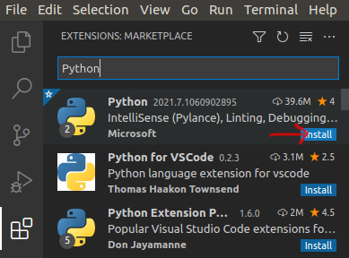

## 2. ⚡ CLAVE ⚡ ¿Cómo usamos *Python* desde *vs code*?
Esta parte es ***CLAVE*** para que el desarrollo sea ágil.

Para los que vienen de *RStudio*, la idea es poder ejecutar líneas o pedazos de código directo en el intérprete, tal como se hace desde RStudio con `ctrl + enter`.

Para esto (previo haber instalado el plugin de la sección 1) sólo tenemos que:

1. seleccionar el código que queremos ejecutar:

2. y apretar `shit + enter`: *vs code* se va a encargar de abrir -*un intérprete de*- *Python* y ejecutar el pedazo de código que teniamos seleccionado.

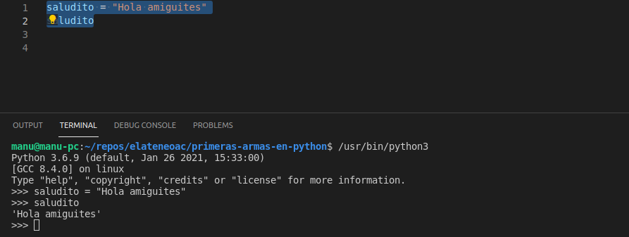

*en la imagén vemos que abajo se abre otra ventana con un intérprete. Tal cual como en *RStudio*.*

3. ahora ya con -un intérprete de- *Python* asociado, la próxima vez que hagamos lo mismo, se vuelve a ejecutar en el mismo interprete:

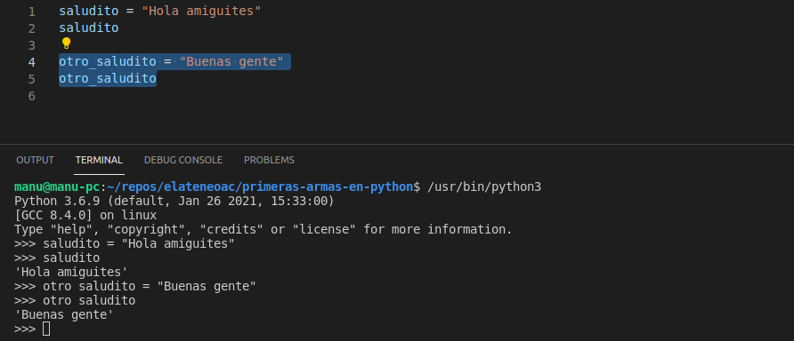

4. para ejecutar una línea entera, ponemos el -*cursor del*- mouse en la línea que queramos ejecutar, y apretamos de nuevo el buen `shit + enter`:

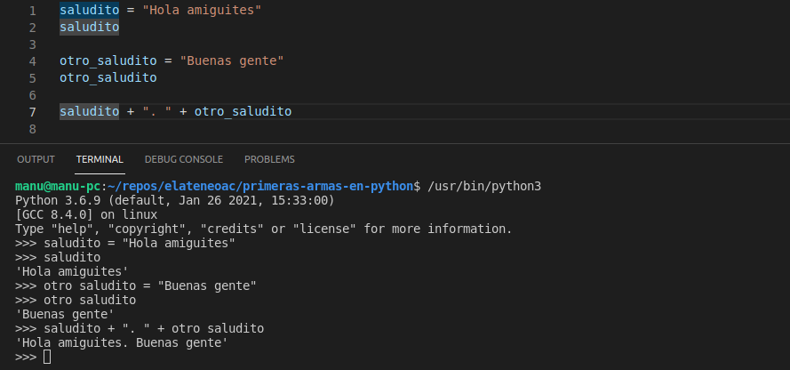

5. para cerrar el intérprete, escribimos `exit()` y le damos `enter`: se cierra el intérprete y nos devuelve a la terminal de comandos del sistema operativo (en este ejemplo la terminal de *Ubuntu*).

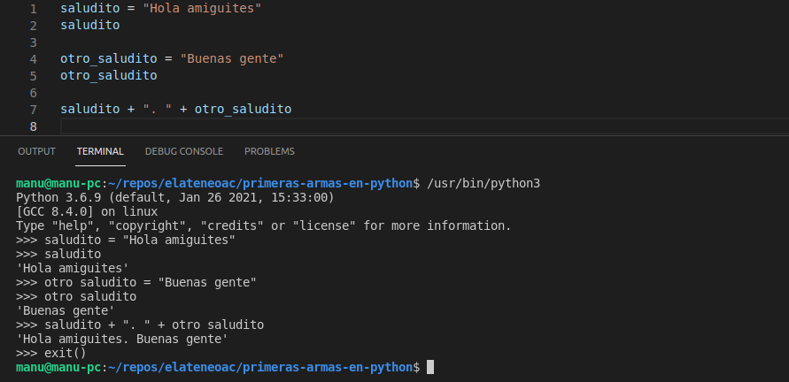

### 💡 ***TIP 2.1.*** 💡 para cuando la ejecución se pone ***LENTA***
Puede pasar que después de ejecutar bastante código, la ejecución se ponga lenta. Para descomprimir la memoria del intérprete, importamos la librería `os` y limpiamos la consola con `os.system("clear")`:

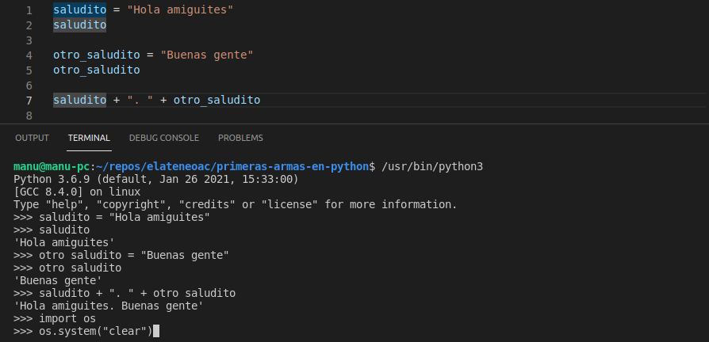

y nos queda así:

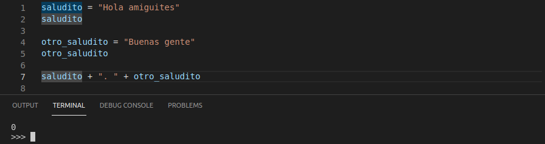

si antes cuando escribían tardaba en responder, prueben ahora a ver si responde bien.

### 💡 ***TIP 2.2.*** 💡 ayuda y autocompletado: `ctrl + espacio`
Una de las grandes ventajas de un **IDE** (*vs code* es un *IDE*, un '*entorno de desarrollo*') es la **ayuda** y el **autocompletado**: en general *vs code* muestra una lista de posibles opciones para completar la línea de código.

Presionando `ctrl + espacio` o incluso **automaticamente al escribir**-, *vs code* ofrece:

- **lista de variables** en uso que coinciden con el mismo nombre:

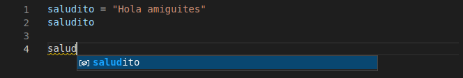

- **métodos disponibles** -*del objeto que está*- en la variable (en este caso, objeto en la variable `'saludito'` es un `String`, entonces me muestra los métodos de `String`):

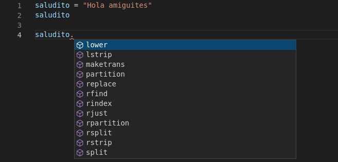

- **métodos disponibles** que coinciden con lo que está escrito:

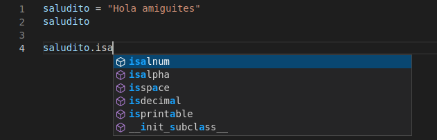

- **ayuda** de los métodos disponibles:

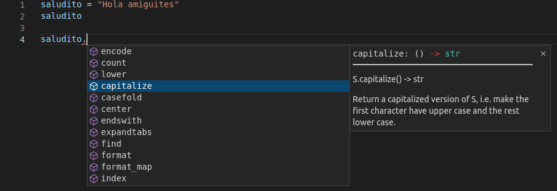

Estas son las principales opciones de **ayuda** y **autocompletado**. Son los más usados, y pueden servir como un puntapié para más opciones: **snippets** (pedazos de código comunes), **snippets personalizados**, **acciones de código** (`ctrl + .`), y más.
