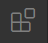
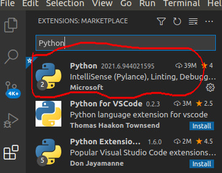

# ***Preparación*** y ***uso*** de *vs code*
En esta notas van detalles de **qué** necesitamos instalar en vs code, y **cómo** vamos a usar *Python* desde *vs code*.

## 0. Tener instalado *Python* y *vs code*
Antes que anda hay que tener instalado Python. Chequear [README.md -> 6. ¿Qué necesito?](../README.md)

## 1. ¿Qué tenemos que instalar en *vs code*?
Para usar *Python* felizmente desde *vs code*, tenemos que instalar el siguiente plugin:

- [Python](https://marketplace.visualstudio.com/items?itemName=ms-python.python) (de **Microsoft**)

    IntelliSense (Pylance), Linting, Debugging (multi-threaded, remote), Jupyter Notebooks, code formatting, refactoring, unit tests, and more.

Para instalar plugin desde vs code:

- click En la opción de *Extensiones* 
- escribir `Python` en el cuadro de texto y darle click en "*Instalar*"

